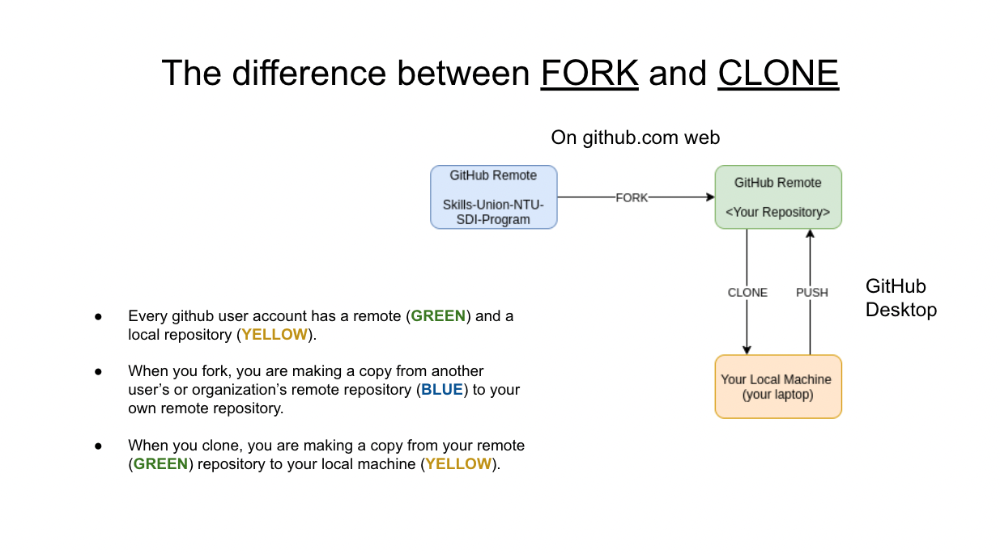

## Brief

### Lesson Overview

This lesson can contain a lot of installations. Learners should expect hiccups and some waiting time while instructor is troubleshooting issues for other learners.

---

## Part 1 - Installation and Account Checks

Check if the learners have installed the following:
1. WSL (for Windows users)
2. NVM for Linux / Mac / WSL
3. VSCode
4. Git

Check if the learners have signed up in the following sites:
1. GitHub
2. W3Schools Canvas
3. W3Schools Pages

Instructors are to assist learners who haven't completed installing the necessary software

---

## Part 2 - Bash Commands

Demonstrate to students what bash commands can do by referring to this [cheatsheet](https://www.educative.io/blog/bash-shell-command-cheat-sheet). Attempt the following Shell Commands in 5 mins as part of demo:
```
mkdir test-folder # create new folder
pwd # print working directory (current directory)
cd test-folder # change directory to 'test-folder'
pwd # print current directory and observe the difference
touch a.txt # create a new file
touch b.txt # create a new file
ls # list all files in current directory
```

---

## Part 3 - Git Basics

Note to instructor: 

It is good for learners to decide on a directory in their laptops where they would clone all repositories into.

Suggestion:

MacOS: ~/suw3
Windows: C:\Users\<your username>\suw3

### Forking vs Cloning
Step 1: Visit [this dummy repository url]() on the browser.

Step 2: Fork it as your own repository.

Step 3: Launch VS Code and open the folder where you would clone all repositories (this folder is created for the lesson).

Step 4: Start a Terminal within VS Code.

Step 5: Enter the command `git clone <url from the forked repo>` and hit Enter.

Step 6: A new folder should appear the directory.



When you fork, you are copying someone else's remote repository to your remote repository.

When you clone, you are copying a remote repository to your local machine (laptop).

### Pushing changes and performing pull requests

Follow these steps to try making changes and push them to the remote repository.

Step 1: Create a new file `test.txt` in the cloned repository (folder). 

Step 2: Open the file and simply type "testing 123" in it.

Step 3: Open up the Terminal and ensure that you are in the directory of the cloned repository (folder) by using `pwd` command.

Step 4: Stage the changed file by typing `git add .`

Step 5: Commit it with a simple message `git commit -m "made changes"`.
Note: "made changes" is the commit message you want to put. 
Tip: Commit messages must be descriptive of the changes done.

Step 6: Push the committed change to remote repository `git push origin main`.

Step 7: Visit your remote repository at github.com to see the changes. The remote repository URL is `https://github.com/<your username>/software-1.1-account-setup-and-git`.

Step 8: Perform a pull request to the upstream repository